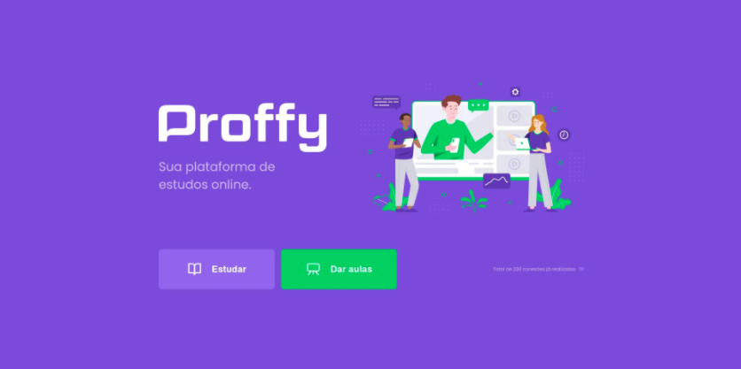
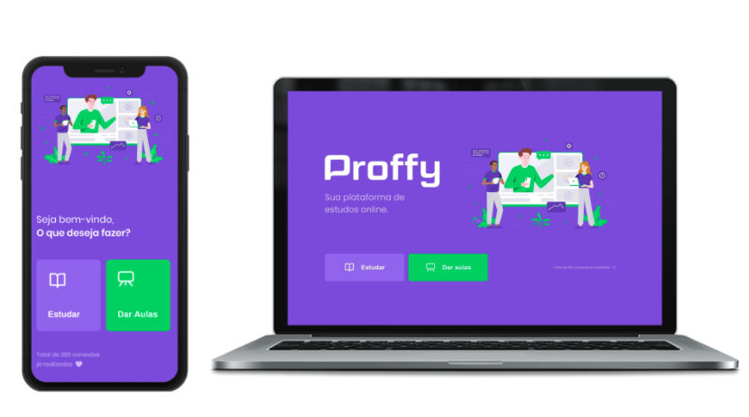

# Proffy - Plataforma de ensino online

## Descrição
> plataforma educacional com o objetivo de conectar alunos e professores

## Telas 

## Sobre o Projeto

> O projeto faz parte da segunda edição da Next Level Week, organizado pela Rocketseat. Toda a aplicação foi desenvolvida em HTML, CSS3, JavaScript, Node JS, SQL lite. 

## Tecnologias utilizadas 
- HTML
- CSS
- JavaScript
- Node JS
- SQL lite
  
